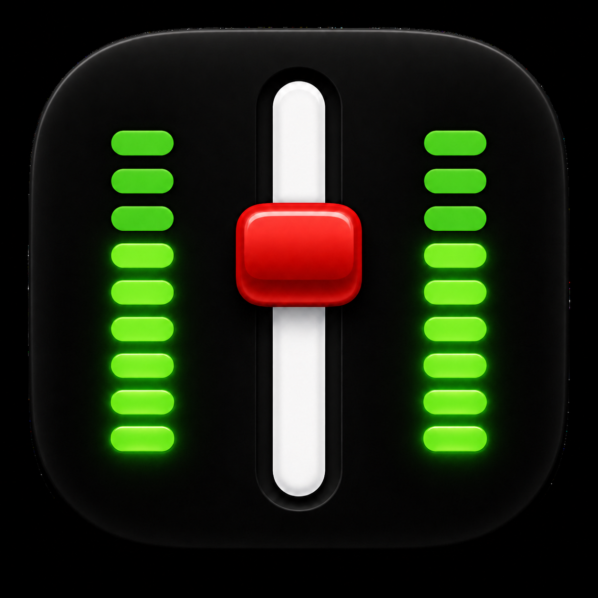
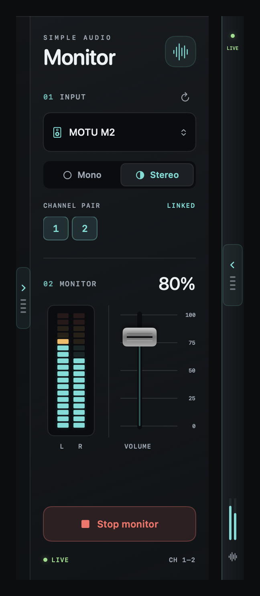

<p align="center">
  
</p>

# Simple Audio Monitor

A compact macOS input monitor with a low-latency direct audio path. It is intended to work like enabling input monitoring on a DAW track, without recording or effects.

## Why

Many musicians—guitarists in particular—connect an electric instrument or a digital pedalboard directly to the input channels of the audio interface they use with their Mac. They then discover that macOS does not automatically route that live input to their speakers or headphones. Without a DAW, amp simulator, or dedicated monitoring app, the result is often silence.

Simple Audio Monitor provides that missing monitoring path: choose the interface input, enable monitoring, and set a comfortable listening level. You can then open any separate audio player, browser, or backing-track app and play along with a song, lesson, or other audio while hearing your instrument at the same time.

## Interface



Expanded and compact interface preview, shown with example device and signal data.

## Features

- Select any Core Audio input device and refresh the device list on demand.
- Monitor one input channel in mono, or link an adjacent pair as stereo.
- Control monitoring volume with a mixer-style fader and a clear 0–100% scale; use the arrow keys when the fader is focused for fine adjustments.
- See independent L/R LED meters for the monitored signal.
- Restore the last device, input mode, channel, and volume automatically at launch.
- Stop monitoring automatically when the Mac enters sleep, preventing the audio route from resuming unexpectedly.
- Open docked to the bottom-right corner of the main display.
- Collapse the 240-point-wide panel to a 28-point side handle with live status and miniature L/R meters; expand it again without interrupting monitoring.
- Move the panel from its native title bar; fader drags remain dedicated to volume adjustment.

## Build and run

Create a double-clickable app bundle:

```sh
chmod +x make-app.sh
./make-app.sh
open ".build/SimpleAudioMonitor.app"
```

You can also run the development executable with `swift run`, but using the app bundle is recommended because it includes the macOS microphone permission message and Dock icon.

On the first launch of a newly signed app identity, allow microphone access in macOS. For actual ultra-low latency, set the preferred buffer size and sample rate in **Audio MIDI Setup** for the selected interface, and use wired headphones to avoid acoustic feedback.

## Notes

The monitor route has no recording or effects: `input → mixer → output`. The L/R meters analyse the incoming signal and apply the fader level for display; they do not account for later system-volume changes or processing outside the app.
